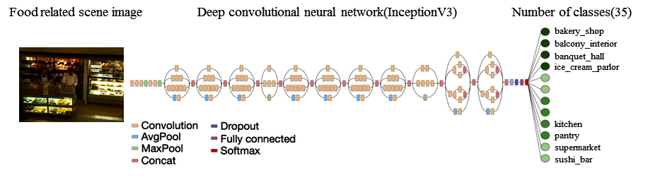

# FoodPlaces: Learning Deep Features for Food Related Scene Understanding

### Introduction
This repository includes the code for reproducing the following paper which was presented in CCIA 2017.

<center></img></center>

If you use this code or its database, please consider citing:

```
  @inproceedings{sarker2017foodplaces,
    title={FoodPlaces: Learning Deep Features for Food Related Scene Understanding},
      author={SARKER, Md Mostafa Kamal and LEYVA, Maria and SALEH, Adel and SINGH, Vivek Kumar and AKRAM, Farhan and RADEVA,         Petia and PUIG, Domenec},
      booktitle={Recent Advances in Artificial Intelligence Research and Development: Proceedings of the 20th International           Conference of the Catalan Association for Artificial Intelligence, Deltebre, Terres de L'Ebre, Spain, October 25-27,           2017},
      volume={300},
      pages={156},
      year={2017},
      organization={IOS Press}
    }
```

## Dependencies
- Keras >=2.0
- Python 3.6


## FoodPlaces Dataset

The EgocentricFood Dataset used for the experimentation can be found [here]().
